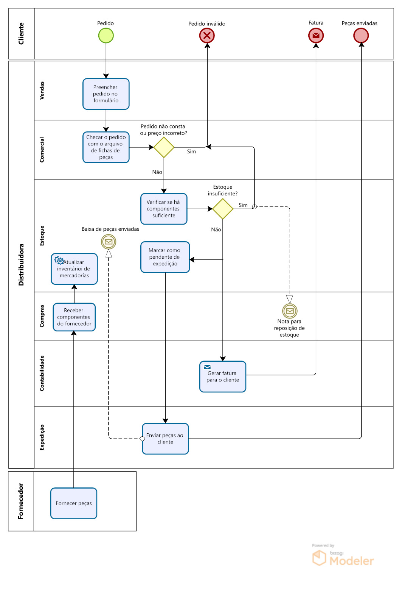

  

### Motivação
> [!IMPORTANT]
>Um distribuidor de peças para aparelhos eletrodomésticos pretende automatizar seu sistema de vendas.

>Os pedidos dos clientes são recebidos normalmente (mas não necessariamente) por telefone, pela área de vendas que preenche o pedido no formulário padrão verde. O pedido, então, passa para o comercial que checa o pedido com o arquivo de fichas de peças e coloca o número do código da peça pedida ao lado do nome e verifica se o preço está correto. Algumas vezes, o pedido é para uma peça cujo nome
>não consta no arquivo ou o preço está incorreto e, então, o pedido é marcado como inválido e
>colocado de lado. Pedidos válidos são passados para o pessoal da área de estoque, que checa o
>livro de inventário de mercadorias, para verificar se há componente suficiente para atender ao pedido. Se o estoque é insuficiente, o pessoal rejeita o pedido e envia uma nota à área de
>compras para reposição do estoque. Se o estoque é suficiente, a quantidade pedida é marcada
>como pendente de expedição e a via cor- de-rosa do pedido é enviada para a contabilidade, para
>que seja gerada uma fatura para o cliente. O pessoal da expedição envia as peças pedidas ao
>cliente e dá baixa no inventário de mercadorias. O pessoal de compras atualiza o inventário de
>mercadorias quando recebe componentes do fornecedor.