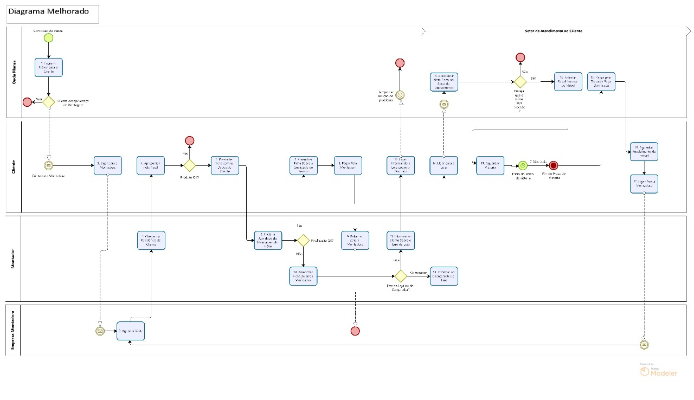

> [!IMPORTANT]
>Uma empresa tercerizada

  

1.	Após efetuar a compra o cliente escolhe se ele deseja montar por conta própria ou se quer que uma montadora vá na residência e manda o móvel para a casa do cliente. Se ele quiser montar, termina o processo, se ele quiser a montadora, a empresa entra em contato com a montadora, avisa o cliente através de uma mensagem sobre quando o montador irá fazer a visita. Quando o montador chegar na casa do cliente ele vai averiguar se o produto está ok, se estiver, ele monta e caba o processo. Se não estiver, ele vai definir se foi o cliente ou a loja, se foi o cliente ele vai informar ao cliente e informar a loja para ela resolver esse problema com a central de atendimento através de uma ligação e escolher se o móvel deve ser trocado, se sim, a loja vai agendar a vistoria, fazer o recolhimento do móvel, a entrega do móvel e reinicia o cliclo do getway onde o cliente escolhe se quer montar o móvel. Se foi a loja, ele vai informar ao cliente par que ele tome as providencias com a loja e vai notificar a loja sobre o problema e acaba o processo.