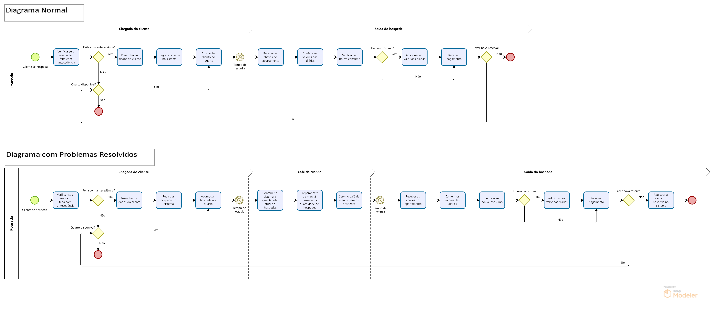

> [!IMPORTANT]
>Uma pousada

  

Uma pousada está com um problema e por isso contratou uma empresa de desenvolvimento TI para ajudá-la a criar um processo para ajudar a resolver o problema.
O problema é o seguinte: Essa pousada serve café da manhã para todos os seus clientes, mas não está conseguindo servir o café de acordo com a demanda dos clientes e nem sabe quando os clientes estão na pousada ou não.

1.	O cliente quando se hospeda, na recepção
2.	é verificado se a reserva já foi feita com antecedência, 
3.	caso sim, 
4.	o mesmo preenche todos os seus dados, 
5.	feito o registro no sistema 
6.	e acomodado no quarto
7.	, caso contrário
8.	, é verificado se tem quarto disponível
9.	, se tiver
10.	, e somente após essa verificação 
11.	o mesmo é acomodado no quarto.
12.	No momento da saída
13.	, o mesmo entrega as chaves do apartamento
14.	, conferido os valores das diárias
15.	, verificado se houve consumo
16.	, caso tenha havido
17.	, adicionado ao valor das diárias
18.	 e pago o valor. 
19.	Caso o cliente queira efetuar uma nova reserva
20.	, a mesma é feita neste momento
21.	, caso contrário
22.	, nenhuma reserva é feita.
