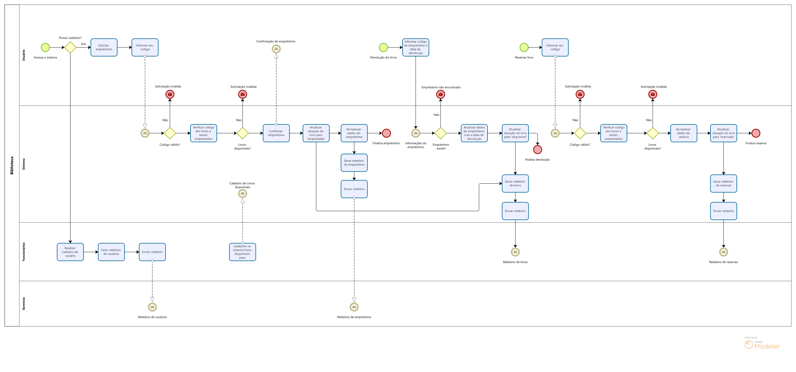

> [!IMPORTANT]
>Uma Biblioteca Universitária

  

Uma biblioteca universitária deseja criar um Sistema de Empréstimo de Livros e está contratando você para desenvolver este sistema. Foi elaborada a especificação abaixo, baseada na qual, você deve apresentar o BPMN:

1.	A biblioteca só atende a usuários cadastrados.
2.	Os usuários são cadastrados por um funcionário da biblioteca
3.	, que cadastra também os livros disponíveis para empréstimo.
4.	O usuário pode solicitar um empréstimo,
5.	assim ele informa seu código
6.	(o sistema verifica a validade desse código)
7.	e os códigos dos livros a serem emprestados
8.	(os quais serão verificados se estão disponíveis ou se estão reservados para este usuário)
9.	Quando tudo estiver confirmado
10.	o usuário recebe a confirmação do empréstimo
11.	, os dados do empréstimo são armazenados
12.	 e a situação do livro é armazenada como “emprestado”.
13.	Na devolução dos livros,
14.	 o usuário informa o código do empréstimo e a data de devolução.
15.	Confirmada a existência do empréstimo
16.	, os dados do empréstimo são atualizados com a data de devolução
17.	 e a situação do livro é atualizada para “disponível”. 
18.	O usuário ainda pode fazer reserva de livros
19.	informando seu código de usuário
20.	(que é verificado pelo sistema)
21.	 e o código do livro para reserva 
22.	(o qual é verificado se não está disponível).
23.	Se as confirmações estiverem certas
24.	, os dados da reserva são armazenados
25.	 e a situação do livro é atualizada para “reservado”.
26.	A gerência recebe relatórios de usuários
27.	 e de empréstimos em aberto. 
28.	O funcionário recebe relatórios de livros
29.	 e de reservas.
30.	Sempre que um dado for verificado e não for válido, uma mensagem deve ser apresentada ao usuário, informando que o dado informado é inválido.