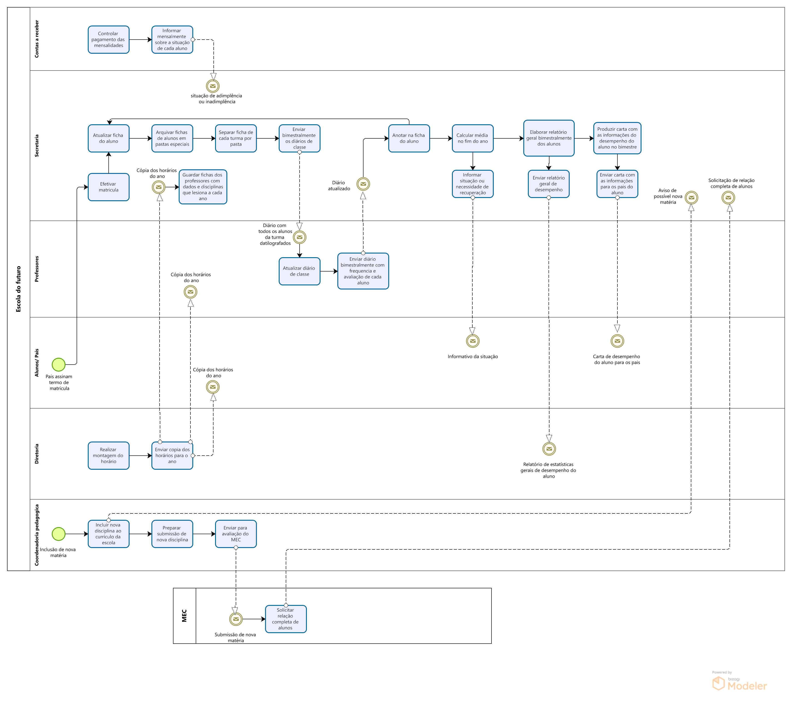

> [!IMPORTANT]
>Uma empresa de serviços de documentação.

  

A Escola de educação infantil “Escola do Futuro” é uma escola recém-inaugurada na cidade. Ela é detentora das mais modernas técnicas pedagógicas e didáticas para formar alunos da pré-escola até o final do ensino fundamental (antiga 8a. série). A escola já está funcionando normalmente, mas seus donos decidiram informatizar o setor de Secretaria a fim de agilizar os serviços e permitir um melhor atendimento aos alunos e pais de alunos que precisam de informações sobre o desempenho escolar, bem como servir como mais um instrumento de apoio aos professores e servidores da escola. 

1.	A secretaria da escola mantém as fichas dos alunos arquivadas em pastas especiais
2.	, separando todas as fichas de cada turma numa pasta. 
3.	Quando o aluno confirma sua matrícula (através da assinatura do termo de matrícula por seus pais ou responsáveis),
4.	 a escola efetiva a matrícula
5.	 atualizando a ficha do aluno na pasta correspondente. 
6.	Eventualmente, também podem ser retiradas fichas por motivos de trancamento ou transferência de escola. 
7.	A secretaria também guarda as fichas dos professores,
8.	com seus dados cadastrais e as disciplinas que leciona a cada ano. 
9.	Quando é feita a montagem do horário,
10.	 o professor e os alunos recebem uma cópia do seu horário para o ano. 
11.	Bimestralmente, o professor recebe da secretaria,
12.	seus diários de classe com todos os alunos da turma datilografados num formulário quadriculado.
13.	Os pagamentos das mensalidades não são controlados pela secretaria e sim pelo setor de Contas a Receber, 
14.	que apenas informa mensalmente a secretaria sobre a situação de adimplência ou inadimplência de cada aluno. 
15.	Uma vez por bimestre, os professores fornecem à secretaria o seu diário de classe atualizado, 
16.	com as anotações sobre frequência e avaliação de cada aluno matriculado.
17.	 Estes dados são anotados na ficha do aluno
18.	 a fim de poder calcular sua média ao final do ano, 
19.	informando-o sobre sua situação escolar e necessidade de recuperação.
20.	 Bimestralmente também é enviada uma carta aos pais dos alunos contendo todas as informações de desempenho durante o bimestre. 
21.	A Gerente da secretaria também elabora um relatório bimestral informando a Diretoria da Escola sobre as estatísticas gerais de desempenho dos alunos.
22.	 Quando a Coordenadoria Pedagógica da escola decide incluir alguma disciplina nova no currículo da escola,
23.	 a secretaria é avisada 
24.	e prepara um relatório de submissão da nova disciplina à avaliação do MEC.
25.	 Às vezes o MEC também solicita à secretaria da escola uma relação completa dos alunos matriculados, 
26.	dos alunos com matrícula trancada ou transferida 
27.	e dos alunos que concluíram o curso fundamental na escola.